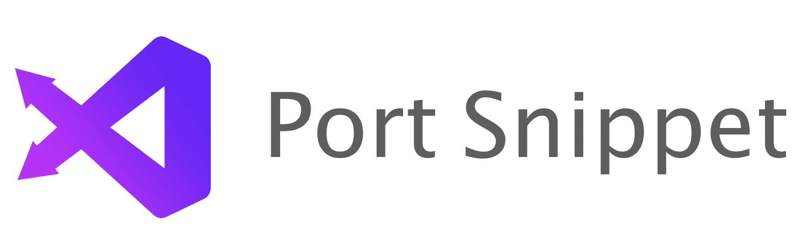
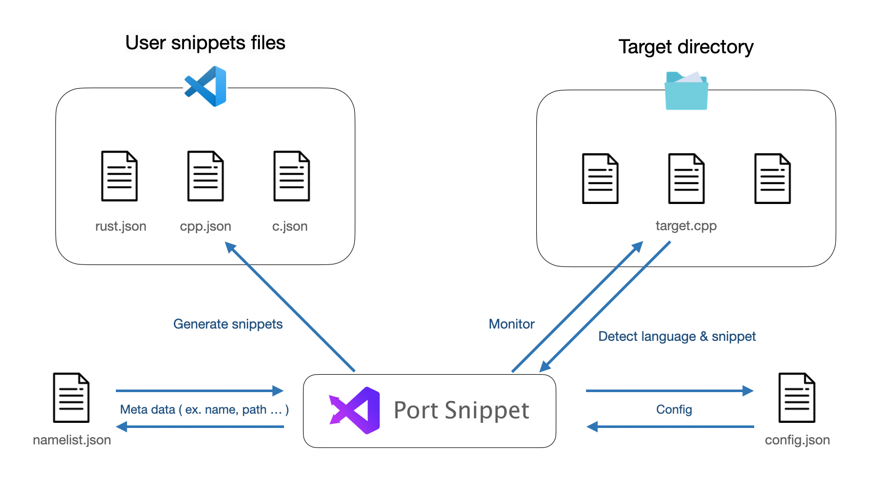

日本語 | [English](https://github.com/YuigaWada/PortSnippet/README.md)

## PortSnippet: スニペットの外部化

PortSnippetとは、VSCode上のスニペットをファイルで管理できるツールです。

コードを決められた書式でファイル内に記述すると、自動でスニペットが生成されます。

またコードとスニペットは同期されており、コードが変更されればそれに応じて**自動でスニペットが変更されます。**

## Demo


## 既存のシステムはどうなってるの？

VSCodeに内蔵されているスニペットシステムは、スニペットをJSON形式で管理しているため、以下のような良くない点🙅‍♀️があります。

- スニペットを編集しにくい
- 読めない
- 単一のJSONに管理するのはクールじゃない

そこで、PortSnippetは純正のスニペットシステムを隠蔽し、スニペットコードを外部ファイルへと分離できるようにします。([#How it works](#how-it-works))

## 導入方法

1. [ダウンロード](https://github.com/YuigaWada/PortSnippet/releases)する.
2. [こちらのファイル](https://github.com/YuigaWada/PortSnippet/tree/master/files) を実行ファイルと同じフォルダにコピー.
3. `config.json`を設定. ([#Config](#Config))
4. `port_snippet`を実行. (Windowsユーザーの場合は管理者権限で実行してください)

実行すると、`port_snippet`がバックグラウンドで起動し、自動でdaemon(Windows Service)として登録されます。

(正常に登録されているならば、PC起動時に自動でPortSnippetが立ち上がるようになります。)


## How to use

スニペットとして登録したいコードを以下のようにタグで囲んでください。

一つのファイルに対して何度でもスニペットを登録することができます。

### Meta Tags

```cpp
// #PORT#
// name: ""
// prefix: ""
// description: ""

```

```cpp
// #PORT_END 
```

PortSnippetはこれらのタグを正規表現によって検知します。

したがってコメントの書式は問いません。(`//`でも`#`でも何でも構わないです。)

### Example

```cpp
// #PORT#
// name: "SegmentTree"
// prefix: "seg"
// description: "セグ木"

template <class S, S (*op)(S, S), S (*e)()> struct segtree {
    segtree() : segtree(0) {}

    ...

    void update(int k) { d[k] = op(d[2 * k], d[2 * k + 1]); }
};

// #PORT_END#

```

## Config

PortSnippetと同じフォルダの中に、以下のような内容の`config.json`を置く必要があります。

```json 
{
    "snippets_dir": "",
    "dirs": [
        ""
    ],
    "files": [
        ""
    ]
}
```

なお`"snippets_dir"`はお使いのOSによって異なります。詳しくは[こちら](https://vscode-docs.readthedocs.io/en/stable/customization/userdefinedsnippets/)を参照してください。

自分の環境に合わせて、以下のパスを**絶対パスで**記述してください。

- Windows:  `%APPDATA%\Code\User\snippets`
- Mac `$HOME/Library/Application Support/Code/User/snippets`
<!-- - Linux $HOME/.config/Code/User/snippets/(language).json -->

<br>

`"dirs"` や `"files"` にはスニペットを置くファイル・フォルダを**絶対パスで**記述してください。

これらのファイル内でコードの変更があれば、PortSnippetは変更を検知し自動でスニペットを生成・編集します。

なお、`config.json`を編集した後は、必ずPortSnippetを再起動してください。([#Arguments](#Arguments))


## lang.json

PortSnippetと同じフォルダの中に 以下のような `lang.json` を置いてください。

```json 
{
    "lang": [
        {
            "name": "Rust",
            "identifier": "rust",
            "extension": "rs"
        },
        {
            "name": "C",
            "identifier": "c",
            "extension": "c"
        },

        {
            "name": "C++",
            "identifier": "cpp",
            "extension": "cpp"
        },
    ]  
}
```


`lang.json` には各言語ごとに紐付けられた拡張子がJSON形式で記述してあります。このファイル内に無い拡張子を扱いたい場合は自分で記述する必要があります。

またVSCodeでは、各言語と一対一に対応する識別子(`language identifier`)を用いてスニペットが管理されています。上の例における `identifier` には、その`language identifier`を記述してください。([参照](https://code.visualstudio.com/docs/languages/identifiers)).


## Arguments

```
usage: ./port_snippet [OPTION] ...

OPTION:
    -m, man: run portsnippet as a foreground process.
    -s, stop: stop a background portsnippet's processs.
    -r, restart: restart a background portsnippet's processs.
    -h, help: print this help messages.
```


## How it works




## Contribute

We would love you for the contribution to **PortSnippet**, check the ``LICENSE`` file for more info.


## Others

Yuiga Wada -  [WebSite](https://yuiga.dev)
Twitter         - [@YuigaWada](https://twitter.com/YuigaWada)


Distributed under the MIT license. See ``LICENSE`` for more information.

[https://github.com/YuigaWada/PortSnippet](https://github.com/YuigaWada/PortSnippet)
