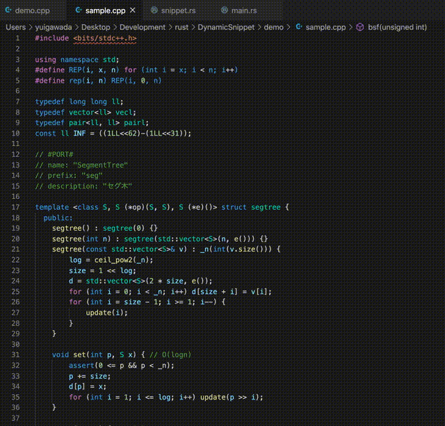

## Port Snippet

PortSnippet monitors source codes and automatically generates snippets! Only for VS Code✌

## Demo



## VSCode System

VSCode saves your snippets in language-specific json files, so the snippet system in VSCode has the following drawbacks.

- Difficult to edit snippets
- Low readability
- Not cool to save snippets in a single file

PortSnippet enables us to manage snippets by multiple files and automatically generates snippets!

## Installation

[Download](https://github.com/YuigaWada/PortSnippet/releases) and run `port_snippet`!

Once you run `port_snippet`, `port_snippet` regiters itself as a daemon (or a Windows Service) and it will automatically start each time your computer is restarted.


## How to use

Put meta tags between your code that you want to save as a snippet!

### Meta Tags

```cpp
// #PORT#
// name: ""
// prefix: ""
// description: ""

```

```cpp
// #PORT_END 
```

PortSnippet detects these meta tags to find `#PORT#` and `#PORT_END#` using regex.


### Example

```cpp
// #PORT#
// name: "SegmentTree"
// prefix: "seg"
// description: "セグ木"

template <class S, S (*op)(S, S), S (*e)()> struct segtree {
    segtree() : segtree(0) {}

    ...

    void update(int k) { d[k] = op(d[2 * k], d[2 * k + 1]); }
};

// #PORT_END#

```

## Config

You need put a config file on the same directory as PortSnippet.

```json 
{
    "snippets_dir": "",
    "dirs": [
        ""
    ],
    "files": [
        ""
    ]
}
```

`"snippets_dir"` depends on your platform. (check [this](https://vscode-docs.readthedocs.io/en/stable/customization/userdefinedsnippets/))

- Windows:  `%APPDATA%\Code\User\snippets`
- Mac `$HOME/Library/Application Support/Code/User/snippets`
<!-- - Linux $HOME/.config/Code/User/snippets/(language).json -->


<br>

`"dirs"` and `"files"` means files or directories that you want to monitor.

When you change the files that PortSnippet's monitoring, it detects any changes of these files and automatically generate a snippet.

After modifing the config file, make sure to restart PortSnippet! (check [#Arguments](#Arguments))

**※ Use an ABSOLUTE path！ ※**


## lang.json

`lang.json` is a JSON file for list of file extensions. You need put this file on the same directory as PortSnippet.

In Visual Studio Code, every language has a unique specific language identifier. When adding new languange, you need write  `identifier` for the language. Check [this](https://code.visualstudio.com/docs/languages/identifiers).

```json 
{
    "lang": [
        {
            "name": "Rust",
            "identifier": "rust",
            "extension": "rs"
        },
        {
            "name": "C",
            "identifier": "c",
            "extension": "c"
        },

        {
            "name": "C++",
            "identifier": "cpp",
            "extension": "cpp"
        },
    ]  
}
```

## Arguments

```
usage: ./port_snippet [OPTION] ...

OPTION:
    -m, man: run portsnippet as a foreground process.
    -s, stop: stop a background portsnippet's processs.
    -r, restart: restart a background portsnippet's processs.
    -h, help: print this help messages.
```


## How it works


## Contribute

We would love you for the contribution to **PortSnippet**, check the ``LICENSE`` file for more info.


## Others

Yuiga Wada -  [WebSite](https://yuiga.dev)
Twitter         - [@YuigaWada](https://twitter.com/YuigaWada)


Distributed under the MIT license. See ``LICENSE`` for more information.

[https://github.com/YuigaWada/PortSnippet](https://github.com/YuigaWada/PortSnippet)
